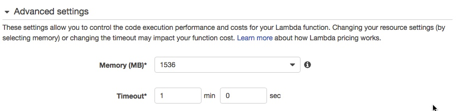

# alexa-tube
Unofficial Youtube Skill for Alexa


This skill is a proof of concept that allows Alexa to search for youtube videos and play the audio element - NOTE doing so is against the youtube terms of service

## SKILL COMMANDS

1. Request a particular video: "Alexa, ask youtube to play 'Charley bit my finger'"
2. Request an auto generated playlist of 25 results: - "Alexa ask Youtube to play SOME David Bowie"
3. Request a particular track from the playlist: "Alexa, ask Youtube to play Track 10"
4. Skip to the next/previous track:- "Alexa, next/ previous track"
5. Pause:- "Alexa pause" or "Alexa stop"
6. Resume playback:- "Alexa resume" NOTE - this will restart the track from the beginning
7. Find out what is playing by asking "Alexa ask Youtube what's playing"
8. Loop the current playlist:- "Alexa Loop On/Off"
9. Shuffle mode On/Off:- "Alexa shuffle On/Off"
10. Start the track currently playing fromt he beginning:- "Alexa Start Over"

Following a search request, the skill produces an Alexa App card which lists upto 25 results and shows the track that is currently playing. This card is not produced when the next track plays unless the "next" command is used

Currently if the skill tries to play a video longer than 2 hours then it will stop with an error - !! I need to fix this!!

Whilst Alexa can play the MPEG DASH streams, it does not support seeking within the file, so resuming after a pause will start the track from the beginning.


## TECHNICAL

The mpeg4 aac DASH audio stream URL provided by the API is read using YTDL-core and the resulting audio is temporarily cached into dropbox inorder for Alexa to play the stream. 

Dropbox is used rather than S3 as although it is significantly slower to transfer the data (by an order of magnitude) there are no download bandwidth charges for dropbox unlike S3. 

The skill creates a folder in your dropbox called youtube-skill, into which it writes 2 files, audio.mp4 which contains the audio to be played by Alexa and a files settings.json which holds the skills settings between sessions. 

Each time a track plays, the skill overwrites audio.mp4 and creates a unique public URL which is sent to the Echo device. No other files are made public (infact the skill is setup to only be able to access files and folders that it has created).

**NOTE - you might want to exclude the "youtube-skill" folder from your Selective Sync settings on any desktop machines to stop any annoying notifications popping up each time a song plays! 


## SETUP INSTRUCTIONS (TEXT)

1. Create a youtube api key using the instructions here:-
https://elfsight.com/blog/2016/12/how-to-get-youtube-api-key-tutorial/

Save it to a notepad file and do not share this with anyone else!!!

2. Create a dropbox access token using the instructions here:-
http://www.iperiusbackup.net/en/create-dropbox-app-get-authentication-token/

Again, save it to a notepad file and do not share this with anyone else!!!


These instructions are modified from  tartan_guru's Google Assiatnt skill (https://github.com/tartanguru/alexa-assistant)

## Download code from github

1. Click on the green "Clone or download" button just under the yellow bar
2. Click download ZIP
3. Unzip the file (it will be called alexa-youtube-master.zip) to a known place on your hard-drive (suggest root of C: drive in Windows to avoid problems with long filenames)

## AWS Lambda Setup (Part 1)

1. Go to http://aws.amazon.com/. You will need to set-up an AWS account (the basic one will do fine) if you don't have one already. Make sure you use the same Amazon account that your Echo device is registered to. **Note - you will need a credit or debit card to set up an AWS account - there is no way around this. Please see the AWS Charges section above**

2.  Go to the drop down "Location" menu at the top right and ensure you select US-East (N. Virginia) if you are based in the US or EU(Ireland) if you are based in the UK or Germany. This is important as only these two regions support Alexa. NOTE: the choice of either US or EU is important as it will affect the results that you get. The EU node will provide answers in metric and will be much more UK focused, whilst the US node will be imperial and more US focused.


1. Select Lambda from the AWS Services menu at the top left
2. Click on the "Create a Lambda Function" or "Get Started Now" button.
3. Select "Blank Function" - this will automatically take you to the "Configure triggers" page.


4. Click the dotted box and select "Alexa Skills Kit" (NOTE - if you do not see Alexa Skill Kit as an option then you are in the wrong AWS region). 


5. Click Next 


5. Name the Lambda Function :-

    ```
    youtube
    ```
    
5. Set the decription as :-

    ```
    Youtube
    ```
    
6. Select the default runtime which is currently "node.js 6.10".
7. Select Code entry type as "Upload a .ZIP file". 


7. Click on the "Upload" button. Go to the folder where you unzipped the files you downloaded from Github, select index.zip and click open. Do not upload the alexa-assistant-master.zip you downloaded from Github - only the index.zip contained within it.
8. Enter the following into the Environment Variables Section (If you are pasting in the API Key and Toekn then make sure you have no extra spaces: -

|Key           | Value|
|--------------| -----|
|API_KEY|(Put the Google API key in here)|
|DROPBOX_TOKEN|(Put the Dropbox token in here)|

 

9. Keep the Handler as "index.handler" (this refers to the main js file in the zip).
10. Under Role - select "Create a custom role". This will automatically open a new browser tab or window.


11. Switch to this new tab or window. 
11. Under IAM Role select "Create a new IAM Role"
11. Then press the blue "Allow" box at the bottom right hand corner. The tab/window will automatically close.
11. You should now be back on the Lambda Management page. The Role box will have automatically changed to "Choose an existing role" and Role we just created will be selected under the "Existing role" box.


12. Under Advanced Settings set Memory (MB) to 1536 and change the Timeout to 12 seconds



13. Click on the blue "Next" at the bottom of the page and review the settings then click "Create Function". This will upload the Archive.zip file to Lambda. This may take a number of minutes depending on your connection speed. **NOTE - If the creation process takes more than five minutes or produces an error similar to "Signature expired: 20170612T135832Z is now earlier than 20170612T142721Z (20170612T143221Z - 5 min.)" then this is due to having a slow internet upload speed.  You'll need to upload the zip file via S3 instead. Go here:- https://console.aws.amazon.com/s3/home. Create a bucket - call it whatever you want. You can then upload the index.zip to that S3 bucket. Once it's uploaded use the "Upload a file from S3" rather than the "Upload a zip " option in the lambda setup.**


14. Copy the ARN from the top right to be used later in the Alexa Skill Setup (it's the text after ARN - it won't be in bold and will look a bit like this arn:aws:lambda:eu-west-1:XXXXXXX:function:google-assistant). Hint - Paste it into notepad or similar.

## Alexa Skill Setup

1. In a new browser tab/window go to the Alexa Console (https://developer.amazon.com/edw/home.html and select Alexa on the top menu)
1. If you have not registered as an Amazon Developer then you will need to do so. Fill in your details and ensure you answer "NO" for "Do you plan to monetize apps by charging for apps or selling in-app items" and "Do you plan to monetize apps by displaying ads from the Amazon Mobile Ad Network or Mobile Associates?"


1. Once you are logged into your account go to to the Alexa tab at the top of the page.
2. Click on the yellow "Get Started" button under Alexa Skills Kit.


3. Click the "Add a New Skill" yellow box towards the top right.


4. You will now be on the "Skill Information" page.
5. Set "Custom Interaction Model" as the Skill type
6. Select the language as English (US), English (UK) - **Note German is not currently supported**
6. Set the "Name" to 

    ```
    Youtube Skill for Alexa
    ```
    
8. Set the "Invocation Name" to 

    ```
    youtube
    ```
8. Set the "Audio Player" setting to "Yes"
8. Leave the other settings in Global Fields set to "No'
9. Click "Save" and then click "Next".


10. You will now be on the "Invocation Model" page.
11. Copy the text below into the "Intent Schema" box.

    ```
    {
      "intents": [
        {
          "intent": "AMAZON.ResumeIntent"
        },
        {
          "intent": "AMAZON.PauseIntent"
        },
        {
          "intent": "AMAZON.StopIntent"
        },
        {
          "intent": "AMAZON.NextIntent"
        },
        {
          "intent": "AMAZON.CancelIntent"
        },
        {
          "intent": "AMAZON.LoopOffIntent"
        },
        {
          "intent": "AMAZON.LoopOnIntent"
        },
        {
          "intent": "AMAZON.PreviousIntent"
        },
        {
          "intent": "AMAZON.RepeatIntent"
        },
        {
          "intent": "AMAZON.ShuffleOffIntent"
        },
        {
          "intent": "AMAZON.ShuffleOnIntent"
        },
        {
          "intent": "AMAZON.StartOverIntent"
        },
        {
          "intent": "AMAZON.HelpIntent"
        },

        {
          "slots": [
            {
              "name": "search",
              "type": "SEARCH"
            }
          ],
          "intent": "SearchIntent"
        },
        {
          "slots": [
            {
              "name": "number",
              "type": "AMAZON.NUMBER"
            }
          ],
          "intent": "NumberIntent"
        },
        {
          "intent": "NowPlayingIntent"
        },
        {
          "intent": "AutoOn"
        },
        {
          "intent": "AutoOff"
        }
      ]
    }
    ```


12. Under Custom Slot Types:-
13. Type into the "Enter Type" field (NOTE - this is captialised) :-
    ```
    SEARCH
    ```
    
14. Copy the text below and paste into the "Enter Values" box and then click "Add" (NOTE you must click ADD)

    ```
    prince
    the fray
    the rolling stones
    toad the wet sproket
    KC and the sunshine band
    john travolta and olivia newton john
    DJ jazzy jeff and the fresh prince
    lola
    hello dolly
    love me tender
    fools gold
    roberta flack killing me softly with his song
    stevie wonder superstition
    boston
    full circle
    dubstar
    underworld
    orbital
    let me be your fantasy
    pop will eat itself
    ultra nate
    ```

Credit to https://github.com/rgraciano/echo-sonos/blob/master/echo/custom_slots/NAMES.slot.txt for some of these

15. Copy the text below and paste them into the Sample Utterances box.

    ```
    SearchIntent play {search}
    SearchIntent find {search}
    SearchIntent play some {search}
    SearchIntent play me some {search}
    SearchIntent videos by {search}
    SearchIntent me videos by {search}
    SearchIntent music by {search}
    SearchIntent me music by {search}
    NumberIntent {number}
    NumberIntent play number {number}
    NumberIntent play track {number}
    NumberIntent play track number {number}
    NowPlayingIntent what's playing
    NowPlayingIntent what song is this
    NowPlayingIntent what is this
    NowPlayingIntent what song is playing
    NowPlayingIntent what's this song
    AutoOn turn autoplay on
    AutoOn autoplay on
    AutoOff turn autoplay off
    AutoOff autoplay off
    ```
 

16. Click "Save" and then "Next".
17. You will now be on the "Configuration" page.
18. Select "AWS Lambda ARN (Amazon Resource Name)" for the skill Endpoint Type.
19. Then pick the most appropriate geographical region (either US or EU as appropriate) and paste into the box (highlighted in red in the screenshot) the ARN you copied earlier from the AWS Lambda setup.
 
20. Select "No" for Account Linking
14. Click "Save" and then "Next".
15. There is no need to go any further through the process i.e. submitting for certification. You can test the skill by typing a search into the Service Simulator filed e.g. "play some cat videos" NOTE- the actual audio from youtube won't play in the simulator


